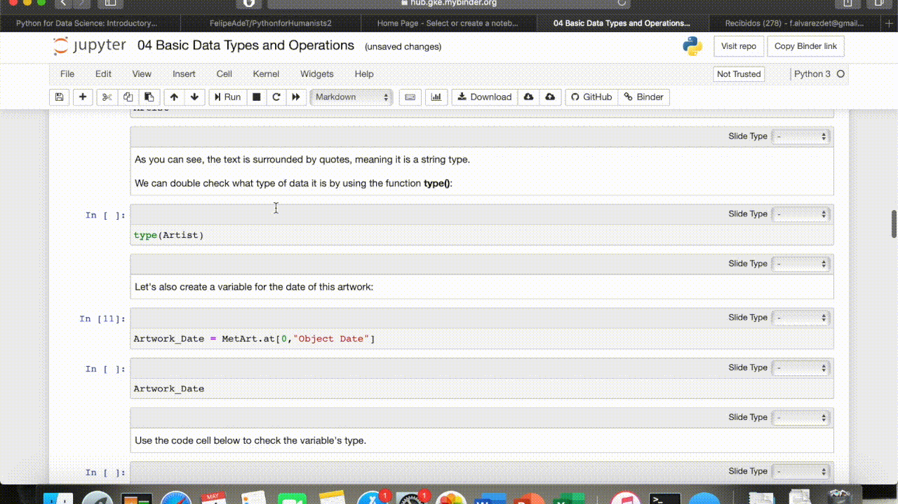
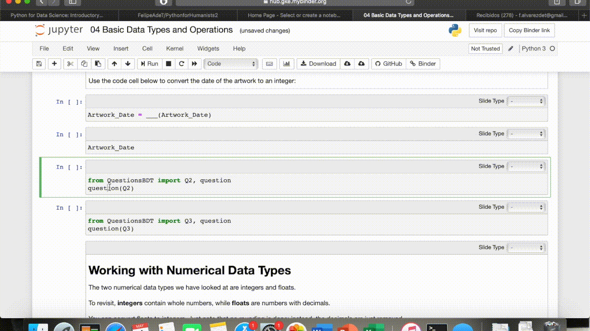

# Python for the Humanities

If you've read the README below and want to start on the interactive lessons, click here --> [](https://mybinder.org/v2/gh/FelipeAdeT/PythonforHumanities/master).

## Course Description

This course imparts the basics of Python for students and scholars working in the humanities. Order and the emphasis differ from courses with other publics in mind. The examples used are intended to illustrate the possibilities of coding for the humanities. Emphasis is initially made on reading and editing existing code, before writing their own. This mirrors the way humanists often have to work on coding projects, progressing and searching for solutions as a project develops. 

The course is intended as an independent online resource that does not need a spoken workshop (though it could serve as a resource in one). Students should emerge from the course with a solid understanding of the basics of Python that they can later increment with further training or self-study.

We provide notebooks for learning Python basics that include short exercises. At the beginning of the course, students modify code to make it work instead of writing it from scratch; as the course advances, students will increasingly work on their own.

Students or teachers can pick notebooks as necessary for a course or project. We cover the standard basics, emphasizing practical needs for humanists, divided into two main sections. Section 1 (Lessons 01-07) provide the building blocks of Python: the semantic and syntactical knowledge necessary for writing functional Python script. We call section 2 (Lessons 08-10) 'Practical Python,' which gives further useful information for developing your own projects. 

**In development** These lessons are followed by 'cases', long-form  practical examples that are relevant to the humanities. Additional notebooks explaining how to install Python and Jupyter Notebooks are also available, as well as a list of resources for further training.

## Course Navigation

This course is a collection of Jupyter Notebooks hosted on Github.  Jupyter Notebooks are files in which text in markdown can be combined with executable code cells. We can thus develop an explanation while allowing you to read, edit, write and run code as you learn.  When viewed on the Github website, these files are not interactive (i.e., users cannot run the code in the examples). These notebooks have also been published on Binder, allowing you to experience this as an interactive resource without having to download anything. The course is available here --> [](https://mybinder.org/v2/gh/FelipeAdeT/PythonforHumanities/master).

**On binder** once the resource has loaded, you should find yourself in a directory with multiple files. Files starting with a number are lessons; you can follow their order or use your own criteria. Once you have decided on a file, you can double-click on it to open.

**Within a file** Jupyter Notebooks are divided into cells, which can include text or code. If you click into a text cell, it is editable; do not worry if you accidentally do this; just press the ** run button** above or click **```shift```+```enter```** to render the markdown again. 


Code cells are grey, and you can also click inside to edit them. To run a code cell, you can click the Run button in the ribbon above or press shift + enter. 



Please run code cells as you encounter them in this course. The first thing to do upon entering a file is running the first code cell, which imports any necessary modules into the file. And don't be scared to edit and experiment! **Changes will not be saved.**

If at some point you find yourself wanting to create a cell to write your own code, click on the left side of any cell and press **```A```** or **```B```** on your keyboard. This will create a cell above or below the cell you have selected.

Finally, we have prepared questions to test your knowledge as the course develops. In-lesson questions appear as a code cell you have to run. Run it by clicking inside the cell and using the run button or shift + enter. The question should appear. Type your answer in the input box, and press enter. This should give you feedback.



To start the course, open the binder link and then double click on 00 Python and the Humanities, which is the first lesson. If you prefer to follow another order, any numbered file is a lesson, giving content and short exercises. Below are descriptions of each file. Cases are long-form coding exercises that provide a workflow for a specific humanities task.

## Course Objectives

Most resources for teaching python are not geared towards humanities students, but to a broader public that often has a programming background. Thus, they spend considerable time on concepts that will not be central to humanistic research, delivering payoff at a considerable delay. Oftentimes, they teach the structures of the language without providing the tools to piece it together for a practical application.

Objectives:

1. Stimulate an interest in Python through  a first contact with key implementations for the humanities.
1. Lay the foundations of reading, modifying and writing Python code in two areas:
    - Teach the building blocks of Python
    - Provide functional knowledge applicable to projects
1. Deliver pay-off early on by:
    - Giving practical, project-oriented examples and exercises
    - Focus on concepts that will be central to humanistic research    
1. Stress understanding and reuse of existing code
1. Point to resources for further learning

## Recommended Course Itinerary

This resource is comprised as a set of modules that can be selected depending on the needs of a particular student or group. Nevertheless, below is a recommended course itinerary for those who want to use all the lessons. 

**Note:** The titles below link to static versions of each lesson on GitHub. To enter the interactive site for the lessons, click on the 'Launch Binder' button at the top of this page.

### Section 1: Building Blocks of Python

- **Introduction** [Python and the Humanities](OO%20Python%20and%20the%20Humanities.ipynb)
- **Lesson 1:** [Reading Python Script: Syntax](01%20Syntax.ipynb)
- **Lesson 2:** [Reading Python Script: Semantics](01%20Semantics.ipynb)
- **Lesson 3:** [Basic Data Types I: Numbers & Numerical Operators](03%20Basic%20Data%20Types%20I%20-%20Numbers.ipynb)
- **Lesson 4:** [Basic Data Types II: Strings](04%20Basic%20Data%20Types%20II%20-%20Strings.ipynb)
- **Lesson 5** [Basic Data Types III: Collections](05%20Basic%20Data%20Types%20III%20-%20Collections.ipynb)
- **Lesson 6**[Conditionals](06%20Conditionals.ipynb)
- **Lesson 7** [Loops](07%20Loops.ipynb)
[- **Lesson 7B** [Putting it all together](07B%20Putting%20it%20all%20Together%20(Lessons%201-5).ipynb)]

### Section 2: Intermediate Python. Python for Projects

- **Lesson 8** [Functions](08%20Functions.ipynb)
- **Lesson 9** [Pandas](09%20Pandas.ipynb)
- **Lesson 10** [Pandas II](10%20Pandas%20II.ipynb)
- **Lesson 11** [Power up your Python](11%20Power%20Up%20Your%20Python.ipynb)

This is an expanding resource. Resources for further learning are available [here](Resources%20for%20Further%20Learning.md). There is also a [Sandbox](Sandbox/Notes%20to%20the%20Next%20Editor.md) area with additional notebooks and files with ideas for future additions.


## Installation Requisites

We are using Binder for all materials (slides, worksheets, etc.). Binder provides an online environment so that there is **no need to install** Python or Jupyter.

That being said, you will need to download Python and Jupyter, as well as additional Python modules, for your future work. We recommend installing these by installing the [Anaconda Suite](https://anaconda.org). Instructions and other options are available online.

## Credits

This resource was developed as part of the [Humanities Unbounded](https://humanitiesunbounded.duke.edu) Digital Humanities Graduate Assistantship at the Duke Center for Data and Visualization Sciences and with funding from the Wired! Lab at Duke University's Art, Art History and Visual Studies Department. 

Many thanks are due to Eric Monson from the Duke Center for Data and Visualization Sciences, whose weekly suggestions were invaluable throughout the many months this project was in development.

## Contact

Felipe Álvarez de Toledo is a Ph.D. candidate in the department of Art, Art History & Visual Studies at Duke University, as well as the Duke Wired! Lab's Spring 2020 Teaching Assistant and 2020-2021 Humanities Unbounded Digital Humanities Graduate Student Assistant at Duke Libraries' Center for Data and Visualization Sciences.

Contact him at fa59@duke.edu for any questions or suggestions.