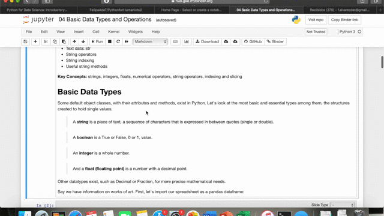

## Python for the Humanities

## Course Description

This course imparts the basics of Python for students and scholars working in the humanities. 

The course is focused on teaching a functional knowledge of the building blocks of Python, but is intended to be less code-heavy and more about being able to read code and use and modify preexisting resources. 

It applies a different approach from typical Python lessons by starting with applicable examples and teaching the meaning of code as the student runs into it. This mirrors the way humanists often have to work on projects that use code, progressing and searching for solutions as a project develops.

The examples used are also intended to illustrate the possibilities of coding for the humanities.

## Objectives

The following are the primary learning objectives for students:

1. Explore Humanities applications of Python

1. Spark an interest in programming with Python

1. Learn to read, modify and write basic Python code

1. Lay the foundations and provide tools for further learning 

## Course Navigation

This course is a collection of Jupyter Notebooks hosted on Github.  Jupyter Notebooks are files in which text in markdown can be combined with executable code cells. We can thus develop an explanation while allowing you to read, edit, write and run code as you learn.  On the Github website, these files can be viewed, but not interacted with (i.e., users cannot run the code in the examples). 

These notebooks have been published on Binder, allowing you to experience this as an interactive resource without having to download anything. The course is available here --> [](https://mybinder.org/v2/gh/FelipeAdeT/PythonforHumanities/master).

It helps to understand the options available on Jupyter Notebooks and Binder to make the most of this learning experience. 

Once the binder has loaded, you should find yourself in a directory with multiple files. Files starting with a number are lessons; you can follow their order or use your own criteria. Once you have decided on a file, you can double-click on it to open.

Notebooks are divided into cells, which can include text or code. If you click into a text cell, it is editable; do not worry if you accidentally do this; just press the ** run ($\triangleright $) button** above or click **```shift```+```enter```** to render the markdown again. 



Code cells are grey, and you can also click inside to edit them. To run a code cell, you can click the Run ($\triangleright $) button in the ribbon above or press shift + enter. 


Please run code cells as you encounter them in this course. The first thing to do upon entering a file is running the first code cell, which imports any necessary modules into the file. And don't be scared to edit and experiment! **Changes will not be saved.**

If at some point you find yourself wanting to create a cell to write your own code, click on the left side of any cell and press **```A```** or *```B```** on your keyboard. This will create a cell above or below the cell you have selected.

Finally, we have prepared questions to test your knowledge as the course develops. In-lesson questions appear as a code cell you have to run. Run it by clicking inside the cell and using the run button or shift + enter. The question should appear. Type your answer in the input box, and press enter. This should give you feedback.


To start the course, open the binder link and then double click on 00 Python and the Humanities, which is the first lesson. If you prefer to follow another order, any numbered file is a lesson, giving content and short exercises. Below are descriptions of each file. Cases are long-form coding exercises that provide a workflow for a specific humanities task.

## Recommended Course Itinerary

This resource is comprised as a set of modules that can be chosen depending on the needs of a particular student or group. Nevertheless, below is a recommended course itinerary for those who want to use all the lessons.

### Section 1: Building Blocks of Python**

**Introduction** [Python and the Humanities](OO%20Python%20and%20the%20Humanities.ipynb)

**Lesson 1:** [Reading Python Script](01%20Reading%20Python%20Script.ipynb)

**Lesson 2:** [Basic Data Types I: Numbers & Numerical Operators](02%20Basic%20Data%20Types%20I%20-%20Numbers.ipynb)

**Lesson 3:** [Basic Data Types II: Strings](03%20Basic%20Data%20Types%20II%20-%20Strings.ipynb)

**Lesson 4** [Conditionals](04%20Conditionals.ipynb)

**Lesson 5** [Loops](05%20Loops.ipynb)

**Lesson5B** [Putting it all together](05B%20Putting%20it%20all%20Together%20(Lessons%201-5).ipynb)

### Section 2: Intermediate Python. Python for Projects

**Lesson 6:** [Accessing Files](06%20Accessing%20Files.ipynb)

**Lesson 7** [Functions](07%20Functions.ipynb)

**Lesson 8** [Further Data Types: Collections](08%20Further%20Data%20Types%20(Collections).ipynb)

**Lesson 9** [Pandas](09%20Pandas.ipynb)

**Lesson 10** [Pandas II](10%20Pandas%20II.ipynb)

**Lesson 10** [Power up your Python](11%20Power%20Up%20Your%20Python.ipynb)

## Section 3: Cases. Useful Workflows & Modules for the Humanities

**Case 1:** [Mapping with Python]()

**Case 2:** [Simple Generative Art]()

**Case 3:** [Cleaning Text with Python]()

**Case 4:** [Text Analysis with Spacy]()

**Case 5:** [Linking Datasets through Fuzzy Matching]()

**Case 6:** [Tidy Data]()

**Case 7:** [Webscraping]()

Other potential cases or subcases: data gathering, data cleaning (text), network analysis, image analysis

## Installation Requisites

We are using Binder for all materials (slides, worksheets, etc.). Binder provides an online environment so that there is **no need to install** Python or Jupyter.

That being said, you will need to download Python and Jupyter, as well as additional Python modules, for your future work. 

We provide the steps for when you choose to do so in [this notebook](Python,%20Jupyter%20and%20Packages%20Installation.ipynb).

## Credits

This resource was developed under the framework of [Humanities Unbounded](https://humanitiesunbounded.duke.edu) at Duke University. 

## Contact

Felipe Álvarez de Toledo is a Ph.D. candidate in the department of Art, Art History & Visual Studies at Duke University, as well as the Duke Wired! Lab's Spring 2020 Teaching Assistant and 2020-2021 Humanities Unbounded Digital Humanities Graduate Student Assistant at Duke Libraries' Center for Data and Visualization Sciences.

Contact him at fa59@duke.edu for any questions or suggestions.